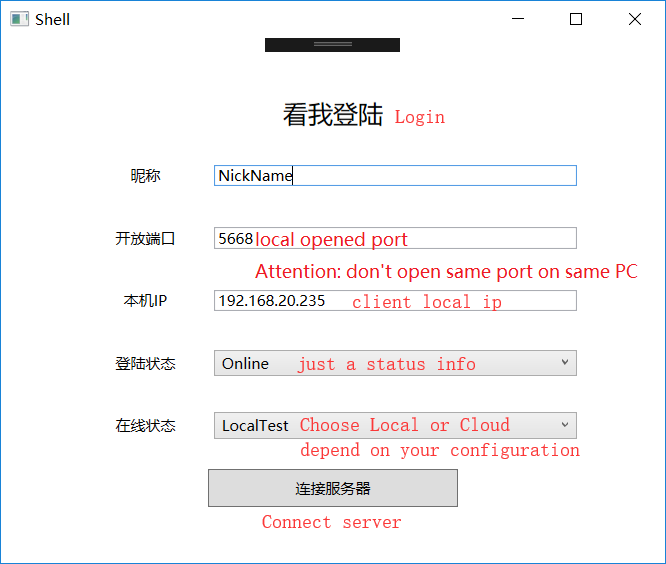
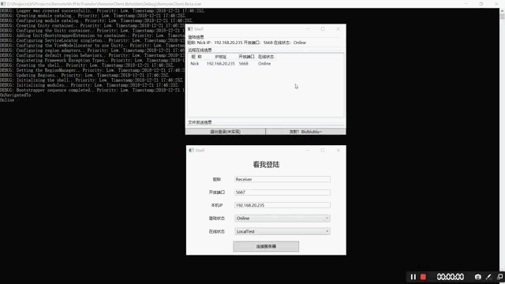

# RemoteWcfFileTransfer  
一个使用WCF实现的大文件远程传输的服务

A large file transmission service by using WCF, it also compatible with other Request&Responsed mode network communication framework.

## **功能**
1.支持断点续传 support breakpoint resume 

2.传输结束时有错误校验 support error check while finish transmission

3.重发机制 support automatic repeat request

4.支持多文件同时传输 support multifile concurrent transmission

5.支持同时向多人传输 support multiclient transmission

6.写入时，防止同名文件被覆盖 prevent same name file from overwriting

## **示例工程(sample project)**

[客户端示例 (client sample)](https://github.com/wingsziye/RemoteWcfFileTransfer/tree/master/RemoteClient.Beta) 

[服务端示例 (server sample)](https://github.com/wingsziye/RemoteWcfFileTransfer/tree/master/TestHostForMetaData/TestHostServer2ClientInterfaces)

## **工作原理(work flow)**


## **如何使用文件传输框架(File transfer code samples):**

1.读取文件 (file reading)

```cs
using FileTransfer.Infrastructure;
using FileTransfer.Infrastructure.Interfaces;

LocalFileReader reader;

public LocalFileReader(IFileSender fileSender)
{
    reader = new LocalFileReader(fileSender);
}

public void RunFullTest(string path)
{    
    reader.RunFileTransfer(path);
}

```

2.传输文件 (file sending)
```cs
using FileTransfer.Infrastructure.Interfaces;
using Remote.Infrastructure.DataContracts;

class LocalFileSender : IFileSender
{
    private IFileWriter writer;

    public LocalFileSender(IFileWriter writer)
    {
        this.writer = writer;
    }

    public FileTransferResponsed UpdateFileData(FileTransferRequest transferData)
    {
        return writer.WriteFile(transferData);
    }

    public BlockTransferResponsed UpdateFileBlockMessage(BlockTransferRequest blockMessage)
    {
        return writer.CheckBlockMessage(blockMessage);
    }
}
```

3.写入文件 (file writting)
```cs
using FileTransfer.Infrastructure;
using FileTransfer.Infrastructure.Interfaces;
using Remote.Infrastructure.DataContracts;

IFileWriter writer = new LocalFileWriter();
```

4.运行测试 (run test)
```cs
using FileTransfer.Infrastructure;
using FileTransfer.Infrastructure.Interfaces;
using Remote.Infrastructure.DataContracts;

static void Main(string[] args)
{
    string path = @".\testfile.jpg";
    IFileWriter writer = new LocalFileWriter();
    var sender = new LocalFileSender(writer);
    new FileTransferTest(sender).RunFullTest(path);
    Console.ReadLine();
}
```

## **如何配置WCF(WCF code samples)：**
1. WCF服务端配置

    use App.config to config your wcf service configuration

        Attention: In this example, security option is set none, just for fast test.

    以下是 App.config 配置文件的示例

```xml
<?xml version="1.0" encoding="utf-8" ?>
<configuration>
    <startup> 
        <supportedRuntime version="v4.0" sku=".NETFramework,Version=v4.5" />
    </startup>
  <appSettings>
  <!-- use for config common 自定义的通用配置 -->
    <add key="DownloadSuffix" value="WcfData" /><!-- default tempfile suffix 默认临时文件后缀 -->
    <add key="DownloadTempDir" value=".\" /><!-- default download path 默认临时文件夹路径 -->
    <add key="UploadPort" value="5668" /><!-- default Upload Port 默认文件传输端口 -->
    <add key="localAddress" value="net.tcp://localhost:12333/" />
    <add key="RemoteAddress" value="net.tcp://win-3jd7guirb36:12886/" />
    <add key="CloudAddress" value="net.tcp://localhost:12886/" />
  </appSettings>
  <!-- 部署服务库项目时，必须将配置文件的内容添加到
 主机的 app.config 文件中。System.Configuration 不支持库的配置文件。 -->
  <system.serviceModel>
    <bindings>
      <netTcpBinding>
        <binding name="nonSecurityTestBinding">
          <security mode="None"/>
        </binding>
        <binding name="pwSecurityTcpBinding">          
          <security mode="TransportWithMessageCredential">
            <message clientCredentialType="UserName"/>
          </security>
        </binding>
      </netTcpBinding>
    </bindings>
    <services>
      <service name="Client2Server.Interfaces.FileUpdateService">
        <!-- Service Endpoints & use non security binding-->
        <endpoint address="net.tcp://localhost:5566/"
                  binding="netTcpBinding"
                  bindingConfiguration="nonSecurityTestBinding"
                  contract="Client2Server.Interfaces.IFileUpdateService"/>
      </service>
    </services>
    <behaviors>
      <serviceBehaviors>
        <behavior>
          <!-- 要接收故障异常详细信息以进行调试，
          请将以下值设置为 true。在部署前设置为 false 
          以避免泄漏异常信息 -->
          <serviceDebug includeExceptionDetailInFaults="False" />
        </behavior>
      </serviceBehaviors>
    </behaviors>
  </system.serviceModel>
</configuration>
```
2. 启动WCF服务端 

    setup your server, startup code basically like the cs code below, and using the "service configuration"  above. and you also can config it by code , pls google  it by yourself.
    
    像网传启动WCF服务端的方式那样启动服务端就好，配置文件可以参考我上方那一段，也可以自行通过代码配置。

```cs
using System;
using System.ServiceModel;
using Client2Server.Interfaces;

class Program
{
    static void Main(string[] args)
    {
        using (ServiceHost host = new ServiceHost(typeof(FileUpdateService)))
        {
            host.Opened += (s, e) =>
            {
                Console.WriteLine("Host is Open!");
            };
            host.Faulted += (s, e) =>
            {
                Console.WriteLine("Host is Faulted!");
            };
            host.Closed += (s, e) =>
            {
                Console.WriteLine("Host is Closed!");
            };
            host.Open();

            Console.WriteLine("Press Enter to exit!");
            Console.ReadLine();
        }
    }
}
```

3. 配置WCF客户端
    
    writting IP address, domain name or website url in client's configuration is necessary. protocal type depend on configuration in your server, such as using net.tcp in my example.

        Attention: In this example, security option is set none, just for fast test.

    你需要在你的客户端配置文件中，填写服务端的地址，计算机名（Windows）、URL或IP地址都可以，协议类型依赖于服务端的配置，比如我的示例，使用的是TCP。

        注意：我为了方便测试，客户端与服务端一样，都使用了无安全类型

```xml
<?xml version="1.0" encoding="utf-8"?>
<configuration>
    <startup> 
        <supportedRuntime version="v4.0" sku=".NETFramework,Version=v4.5" />
    </startup>
  <appSettings>
    <add key="DownloadSuffix" value="WcfData" />
    <add key="DownloadTempDir" value=".\" />
    <add key="UploadPort" value="5668" />
    <add key="RemoteAddress" value="net.tcp://win-3jd7guirb36:12886/" />
    <add key="CloudAddress" value="net.tcp://localhost:12886/" />
  </appSettings>
  <system.serviceModel>
    <bindings>
      <netTcpBinding>
        <binding name="nonSecurityTestBinding">
          <security mode="None" />
        </binding>
      </netTcpBinding>
    </bindings>
    <client>
      <endpoint address="net.tcp://localhost:5566/" binding="netTcpBinding" bindingConfiguration="nonSecurityTestBinding" 
      behaviorConfiguration="includeException" 
      contract="WCF.RemoteOnlineService.IRemoteOnlineService" name="NetTcpBinding_IRemoteOnlineService" />
    </client>
    <behaviors>
      <serviceBehaviors>        
        <behavior name="includeException">
          <serviceDebug includeExceptionDetailInFaults="true" />
        </behavior>
      </serviceBehaviors>      
    </behaviors>
  </system.serviceModel>
</configuration>
```

4. 使用客户端Demo (client demo)





## Dependencies

* [Unity Container](https://github.com/unitycontainer/unity)
* [Prism](https://github.com/PrismLibrary/Prism)